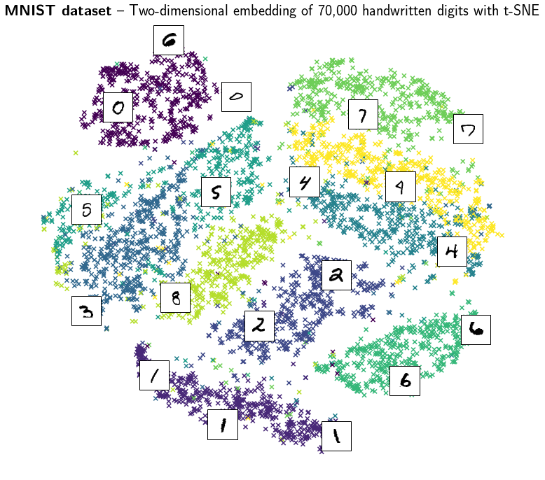
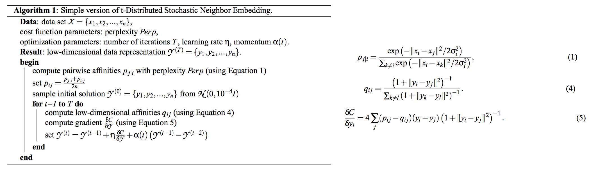

Dear Professor Püschel, dear TAs,

I'm writing on behalf of Group 2 (mail addresses in CC). We would like to do a fast implementation of t-Distributed Stochastic Neighbor Embedding (t-SNE), which is a visualization/manifold learning technique from machine learning.
Below is a visualization of the MNIST handwritten digits dataset using t-SNE (using a  python implementation).

The algorithm it self involves the computation of euclidean distances, Gaussian probability functions, cost terms based on those and gradient descent.
There are currently two algorithms. An exact one in O(n^2) and an approximative O(n log n) one.
Below is the exact algorithm as described in [1].

The O(n log n) algorithm is described in [2]. It calculates the same but does not compute all interactions (there are actually two different optimizations). It rather approximates some in a fashion similar to the fast multipole method. Thus this implementation involves the construction of quadtrees and calculations of the the terms from the quadtree.
We would be fine to implement either algorithm, whichever suites the course better. Therefore we would appreciate feedback on the choice of algorithm to implement.

There are already implementations([3]) for a lot of platforms, but few of them are performing well.

Thank you!

Best Regards, 
Marc R. Fischer

[ 1]: https://lvdmaaten.github.io/publications/papers/JMLR_2008.pdf "Visualizing Data using t-SNE"  
[ 2]: https://lvdmaaten.github.io/publications/papers/JMLR_2014.pdf "Accelerating t-SNE using Tree-Based Algorithms" 
[ 3]: https://lvdmaaten.github.io/tsne/#implementations "Implementations"